## OSI Model
The OSI model is a 7-layered framework for designing and implementing computer networks. It was developed by the International Organization for Standardization (ISO) in 1984.

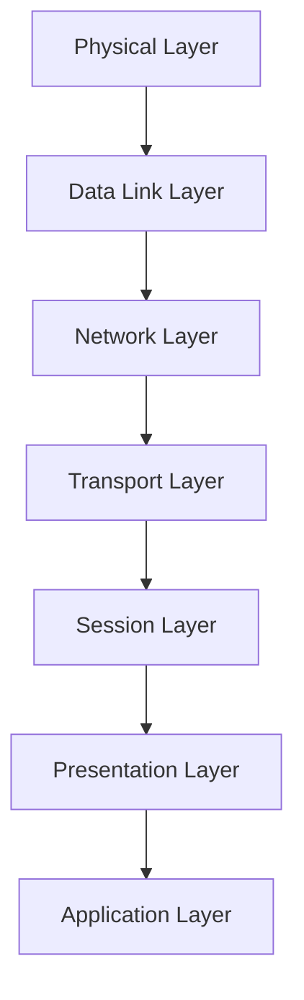

The OSI model layers are:

* **Physical Layer (Layer 1)**: Defines the physical means of transmitting data between devices.
	+ Examples: Wi-Fi, Ethernet, Fiber Optic Cables
	+ Functions: Defines cable specifications, wireless transmission, and network topology
* **Data Link Layer (Layer 2)**: Provides error-free transfer of data frames between two devices on the same network.
	+ Examples: Ethernet, Wi-Fi, PPP (Point-to-Point Protocol)
	+ Functions: Frames data, error detection and correction, flow control
* **Network Layer (Layer 3)**: Routes data between different networks.
	+ Examples: IP (Internet Protocol), ICMP (Internet Control Message Protocol)
	+ Functions: Routing, addressing, congestion control
* **Transport Layer (Layer 4)**: Provides reliable data transfer between devices.
	+ Examples: TCP (Transmission Control Protocol), UDP (User Datagram Protocol)
	+ Functions: Segmentation, connection establishment, error detection and correction
* **Session Layer (Layer 5)**: Establishes, maintains, and terminates connections between applications.
	+ Examples: NetBIOS, SSH (Secure Shell)
	+ Functions: Session establishment, maintenance, and termination
* **Presentation Layer (Layer 6)**: Converts data into a format that can be understood by the receiving device.
	+ Examples: SSL (Secure Sockets Layer), TLS (Transport Layer Security)
	+ Functions: Data compression, encryption, formatting
* **Application Layer (Layer 7)**: Provides services to end-user applications.
	+ Examples: HTTP (Hypertext Transfer Protocol), FTP (File Transfer Protocol)
	+ Functions: Provides services to end-user applications, such as email, file transfer, and web browsing

Each layer has its own specific functions and protocols, and they work together to enable data communication over a network.


## TCP/IP Model
The TCP/IP model is a 4-layered framework for designing and implementing computer networks. It was developed by the Department of Defense's Advanced Research Projects Agency (ARPA) in the 1970s.

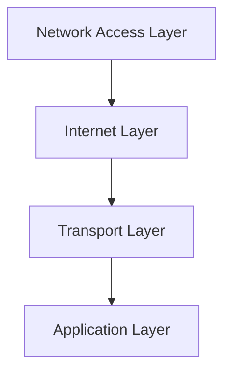

The TCP/IP model layers are:

* **Network Access Layer (Layer 1)**: Defines the physical means of transmitting data between devices.
	+ Examples: Wi-Fi, Ethernet, Fiber Optic Cables
	+ Functions: Defines cable specifications, wireless transmission, and network topology
	+ Protocols: ARP (Address Resolution Protocol), PPP (Point-to-Point Protocol)
* **Internet Layer (Layer 2)**: Routes data between different networks.
	+ Examples: IP (Internet Protocol), ICMP (Internet Control Message Protocol)
	+ Functions: Routing, addressing, congestion control
	+ Protocols: IP (Internet Protocol), ICMP (Internet Control Message Protocol), IGMP (Internet Group Management Protocol)
* **Transport Layer (Layer 3)**: Provides reliable data transfer between devices.
	+ Examples: TCP (Transmission Control Protocol), UDP (User Datagram Protocol)
	+ Functions: Segmentation, connection establishment, error detection and correction
	+ Protocols: TCP (Transmission Control Protocol), UDP (User Datagram Protocol), SCTP (Stream Control Transmission Protocol)
* **Application Layer (Layer 4)**: Provides services to end-user applications.
	+ Examples: HTTP (Hypertext Transfer Protocol), FTP (File Transfer Protocol), SMTP (Simple Mail Transfer Protocol)
	+ Functions: Provides services to end-user applications, such as email, file transfer, and web browsing
	+ Protocols: HTTP (Hypertext Transfer Protocol), FTP (File Transfer Protocol), SMTP (Simple Mail Transfer Protocol), DNS (Domain Name System)

Each layer has its own specific functions and protocols, and they work together to enable data communication over a network.


## Subnetting
Subnetting is the process of dividing a large network into smaller sub-networks. This is done to improve network performance, security, and management.

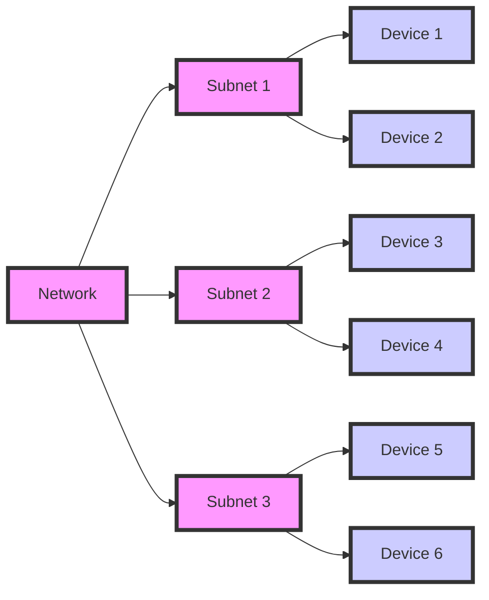

Subnetting involves dividing a large network into smaller sub-networks, each with its own unique IP address range. This allows for more efficient use of IP addresses, improved network performance, and enhanced security.

**Benefits of Subnetting:**

* Improved network performance: By dividing a large network into smaller sub-networks, subnetting can help reduce network congestion and improve overall network performance.
* Enhanced security: Subnetting can help improve network security by isolating sensitive data and systems into separate sub-networks.
* Efficient use of IP addresses: Subnetting allows for more efficient use of IP addresses, as each sub-network can have its own unique IP address range.

**Subnetting Example:**

Suppose we have a large network with 100 devices, and we want to divide it into three sub-networks. We can use subnetting to create three sub-networks, each with its own unique IP address range.

* Subnet 1: 192.168.1.0/24 ( devices 1-33)
* Subnet 2: 192.168.2.0/24 (devices 34-66)
* Subnet 3: 192.168.3.0/24 (devices 67-100)

In this example, we have divided the large network into three sub-networks, each with its own unique IP address range. This allows for more efficient use of IP addresses, improved network performance, and enhanced security.

**Subnetting Techniques:**

* Classful subnetting: This involves dividing a large network into smaller sub-networks based on the class of the IP address.
* Classless subnetting: This involves dividing a large network into smaller sub-networks without considering the class of the IP address.
* Variable Length Subnet Masks (VLSM): This involves using different subnet masks for different sub-networks.

**Subnetting Tools:**

* Subnet calculators: These are online tools that can help calculate subnet masks and IP address ranges for sub-networks.
* Network diagramming tools: These are software tools that can help create network diagrams and visualize subnetting configurations.

**Subnetting Best Practices:**

* Plan carefully: Before implementing subnetting, it's essential to plan carefully and consider the needs of your network.
* Use subnet calculators: Subnet calculators can help ensure that your subnetting configuration is correct and efficient.
* Document your configuration: It's essential to document your subnetting configuration to ensure that it can be easily understood and maintained.
* Document your configuration: It's essential to document your subnetting configuration to ensure that it can be easily understood and maintained.

## DNS
DNS (Domain Name System) is a system that translates human-readable domain names into IP addresses.

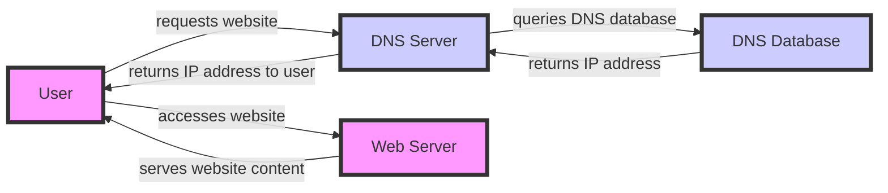

```mermaid
graph LR
    A[URL] -->|Protocol| B[http/https]
    A -->|Subdomain| C[www]
    A -->|Domain Name| D[example]
    A -->|Top-Level Domain| E[.com]
    A -->|Path| F[/path/to/resource]
    A -->|Query String| G[?key=value]
    A -->|Fragment| H[#anchor]
    style A fill:#f9f,stroke:#333,stroke-width:4px
    style B fill:#ccf,stroke:#333,stroke-width:4px
    style C fill:#ccf,stroke:#333,stroke-width:4px
    style D fill:#ccf,stroke:#333,stroke-width:4px
    style E fill:#ccf,stroke:#333,stroke-width:4px
    style F fill:#ccf,stroke:#333,stroke-width:4px
    style G fill:#ccf,stroke:#333,stroke-width:4px
    style H fill:#ccf,stroke:#333,stroke-width:4px
```

**URL Structure:**

* **Protocol:** The protocol used to access the resource, such as http or https.
* **Subdomain:** The subdomain of the website, such as www.
* **Domain Name:** The domain name of the website, such as example.
* **Top-Level Domain:** The top-level domain of the website, such as .com.
* **Path:** The path to the resource, such as /path/to/resource.
* **Query String:** The query string, which contains data to be passed to the server, such as ?key=value.
* **Fragment:** The fragment, which is used to identify a specific part of the resource, such as #anchor.

**Example:**

Suppose we have a URL: `http://www.example.com/path/to/resource?key=value#anchor`

* **Protocol:** http
* **Subdomain:** www
* **Domain Name:** example
* **Top-Level Domain:** .com
* **Path:** /path/to/resource
* **Query String:** ?key=value
* **Fragment:** #anchor

**DNS Resolution:**

When we enter a URL into a web browser, the browser sends a request to a DNS server to resolve the domain name to an IP address. The DNS server then returns the IP address of the server hosting the website.

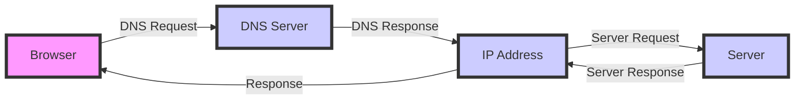

**How DNS Resolution Works:**

1. **DNS Request:** The browser sends a DNS request to the DNS server.
2. **DNS Response:** The DNS server returns the IP address of the server hosting the website.
3. **Server Request:** The browser sends a request to the server hosting the website.
4. **Server Response:** The server returns the requested resource to the browser.
5. **Response:** The browser receives the response from the server and displays the resource to the user.

## DNS Example
For example, when a user requests the website "www.example.com", the DNS server is queried to translate the domain name into an IP address. The DNS server then returns the IP address of the web server hosting the website, and the user's device can access the website.

## DHCP
DHCP (Dynamic Host Configuration Protocol) is a protocol that assigns IP addresses to devices on a network.

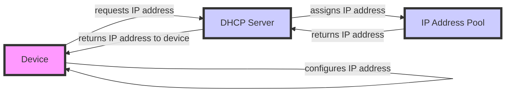


## DHCP Example
For example, when a device connects to a network, it sends a request to the DHCP server for an IP address. The DHCP server then assigns an available IP address from its pool and returns it to the device. The device can then use the assigned IP address to communicate with other devices on the network.


## Routing
Routing is the process of forwarding packets of data between networks. It is a critical function in computer networking that enables data to be transmitted between different networks.

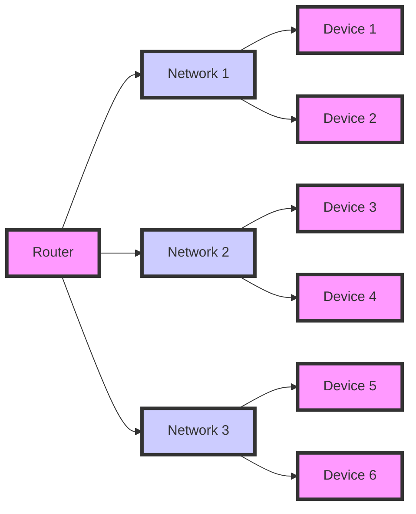

In this diagram, the router (A) is connected to three networks (B, C, and D). Each network has multiple devices connected to it. The router forwards packets of data between the networks, enabling communication between devices on different networks.

**Routing Example:**

Suppose we have a network with three sub-networks: 192.168.1.0/24, 192.168.2.0/24, and 192.168.3.0/24. We want to route traffic between these sub-networks using a router. The router has three interfaces: eth0, eth1, and eth2, each connected to one of the sub-networks.

* eth0: 192.168.1.1/24
* eth1: 192.168.2.1/24
* eth2: 192.168.3.1/24

When a device on the 192.168.1.0/24 network sends a packet to a device on the 192.168.2.0/24 network, the router forwards the packet from eth0 to eth1. Similarly, when a device on the 192.168.2.0/24 network sends a packet to a device on the 192.168.3.0/24 network, the router forwards the packet from eth1 to eth2.

**Routing Protocols:**

There are several routing protocols that can be used to route traffic between networks. Some common routing protocols include:

* RIP (Routing Information Protocol)
* OSPF (Open Shortest Path First)
* EIGRP (Enhanced Interior Gateway Routing Protocol)
* BGP (Border Gateway Protocol)

Each routing protocol has its own strengths and weaknesses, and the choice of protocol depends on the specific network architecture and requirements.

## Switching
Switching is the process of forwarding packets of data within a network. It is a critical function in computer networking that enables data to be transmitted between devices on the same network.

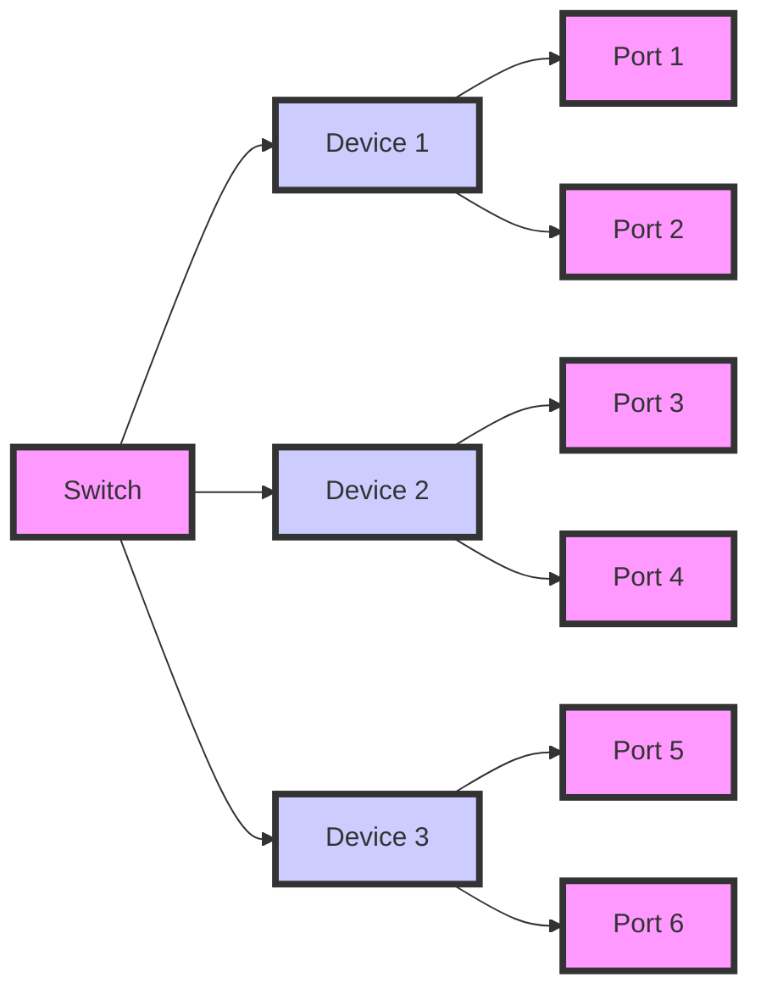

In this diagram, the switch (A) is connected to three devices (B, C, and D). Each device has multiple ports connected to the switch. The switch forwards packets of data between the devices, enabling communication between them.

**Switching Example:**

Suppose we have a network with three devices: a computer, a printer, and a server. We want to connect these devices to a switch and enable communication between them.

* Computer: connected to port 1 on the switch
* Printer: connected to port 2 on the switch
* Server: connected to port 3 on the switch

When the computer sends a packet to the printer, the switch forwards the packet from port 1 to port 2. Similarly, when the printer sends a packet to the server, the switch forwards the packet from port 2 to port 3.

**Switching Protocols:**

There are several switching protocols that can be used to forward packets of data within a network. Some common switching protocols include:

* Spanning Tree Protocol (STP)
* Rapid Spanning Tree Protocol (RSTP)
* Multiple Spanning Tree Protocol (MSTP)

Each switching protocol has its own strengths and weaknesses, and the choice of protocol depends on the specific network architecture and requirements.
Each switching protocol has its own strengths and weaknesses, and the choice of protocol depends on the specific network architecture and requirements.


## NAT
NAT (Network Address Translation) is a technique that allows multiple devices on a private network to share a single public IP address.

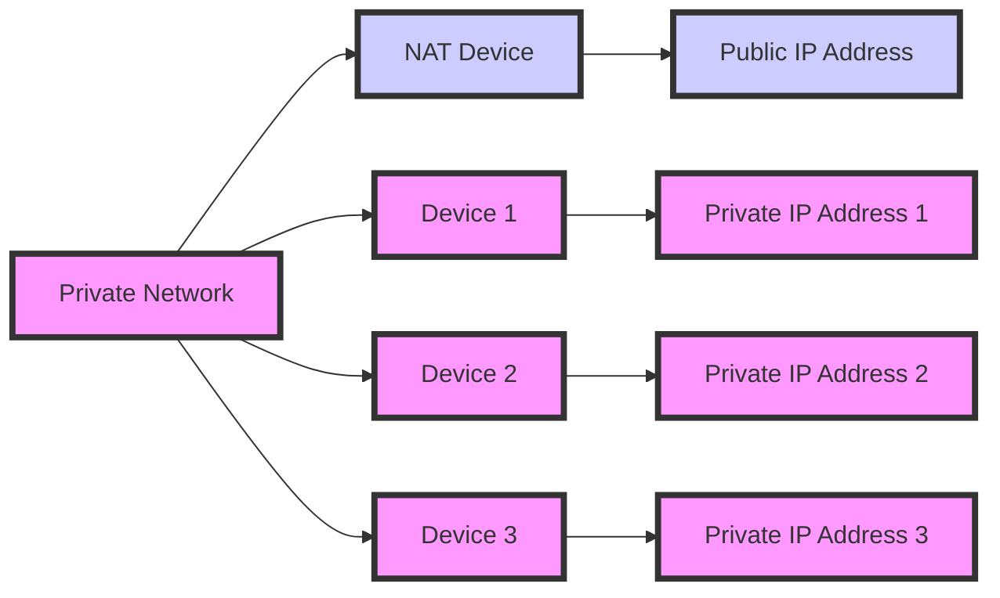

**How NAT Works:**

1. A device on the private network sends a request to access a resource on the internet.
2. The NAT device receives the request and replaces the private IP address of the device with the public IP address.
3. The request is then sent to the internet.
4. When the response is received from the internet, the NAT device replaces the public IP address with the private IP address of the device that made the request.
5. The response is then sent to the device on the private network.

**Example:**

Suppose we have a private network with three devices: a computer, a printer, and a server. We want to allow these devices to access the internet using a single public IP address.

* Private IP addresses:
	+ Computer: 192.168.1.100
	+ Printer: 192.168.1.101
	+ Server: 192.168.1.102
* Public IP address: 203.0.113.100

When the computer sends a request to access a website on the internet, the NAT device replaces the private IP address of the computer with the public IP address.

* Request from computer: 192.168.1.100 -> 203.0.113.100
* Request sent to internet: 203.0.113.100 -> website

When the response is received from the website, the NAT device replaces the public IP address with the private IP address of the computer.

* Response from website: 203.0.113.100 -> 192.168.1.100
* Response sent to computer: 192.168.1.100

## Firewall
A firewall is a network security system that monitors and controls incoming and outgoing network traffic.

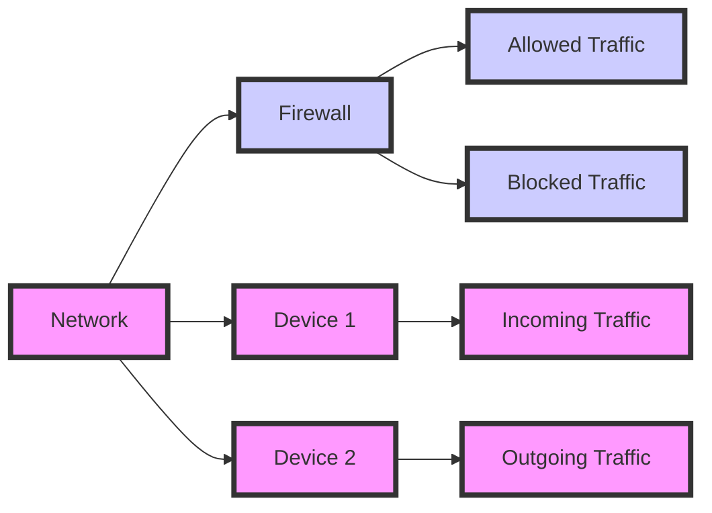

**How Firewall Works:**

1. The firewall receives incoming and outgoing network traffic.
2. The firewall checks the traffic against a set of predefined rules.
3. If the traffic matches a rule, the firewall allows or blocks the traffic.
4. If the traffic does not match a rule, the firewall blocks the traffic.

**Example:**

Suppose we have a network with two devices: a computer and a server. We want to allow incoming traffic to the server on port 80 (HTTP) and block all other incoming traffic.

* Rule 1: Allow incoming traffic to server on port 80
* Rule 2: Block all other incoming traffic

When a request is received from the internet to access the server on port 80, the firewall allows the traffic.

* Request from internet: port 80 -> server

When a request is received from the internet to access the computer on port 22 (SSH), the firewall blocks the traffic.

* Request from internet: port 22 -> computer (blocked)


## HTTP, HTTPS, FTP, SMTP, UDP

These are common network protocols used for communication over the internet.

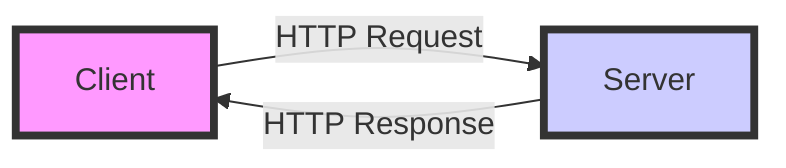

**HTTP (Hypertext Transfer Protocol)**

HTTP is a protocol used for transferring data over the internet. It is a request-response protocol, where a client sends a request to a server and the server responds with the requested data.

**Example:**

Suppose we want to access a website using HTTP. The client (our web browser) sends an HTTP request to the server hosting the website.

* Request: `GET / HTTP/1.1`
* Response: `HTTP/1.1 200 OK`

**HTTPS (Hypertext Transfer Protocol Secure)**

HTTPS is a secure version of HTTP. It uses encryption to protect data transmitted between the client and server.

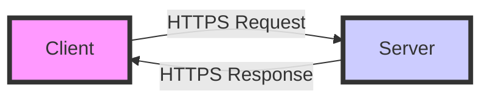

**Example:**

Suppose we want to access a secure website using HTTPS. The client (our web browser) sends an HTTPS request to the server hosting the website.

* Request: `GET / HTTPS/1.1`
* Response: `HTTPS/1.1 200 OK`

**FTP (File Transfer Protocol)**

FTP is a protocol used for transferring files over the internet. It is a client-server protocol, where a client sends a request to a server to upload or download a file.


**Example:**

Suppose we want to upload a file to a server using FTP. The client (our FTP client) sends an FTP request to the server.

* Request: `PUT /file.txt`
* Response: `200 OK`

**SMTP (Simple Mail Transfer Protocol)**

SMTP is a protocol used for sending email over the internet. It is a client-server protocol, where a client sends a request to a server to send an email.

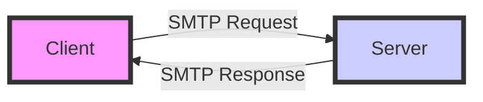

**Example:**

Suppose we want to send an email using SMTP. The client (our email client) sends an SMTP request to the server.

* Request: `MAIL FROM: <sender@example.com>`
* Response: `250 OK`

**UDP (User Datagram Protocol)**

UDP is a protocol used for transmitting data over the internet. It is a connectionless protocol, where data is sent in small packets called datagrams.

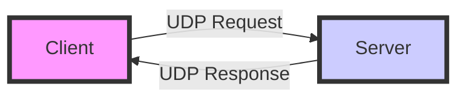

**Example:**

Suppose we want to send data using UDP. The client (our application) sends a UDP request to the server.

* Request: `UDP packet`
* Response: `UDP packet`

| Protocol | Description |
| --- | --- |
| HTTP | Hypertext Transfer Protocol |
| HTTPS | Hypertext Transfer Protocol Secure |
| FTP | File Transfer Protocol |
| SMTP | Simple Mail Transfer Protocol |
| UDP | User Datagram Protocol |otocol |
| UDP | User Datagram Protocol |


## SaaS, IaaS, PaaS
These are cloud computing service models.

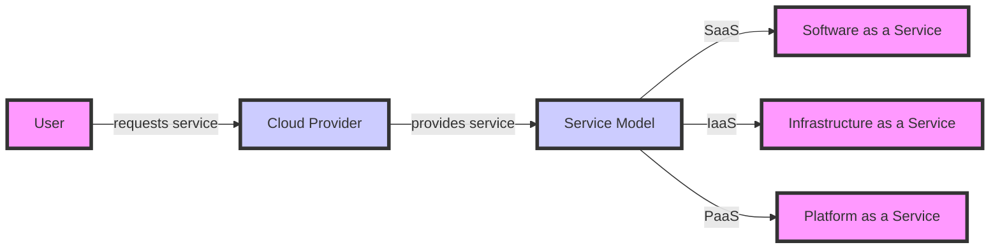

**SaaS (Software as a Service)**

SaaS is a cloud computing service model that provides software applications over the internet.

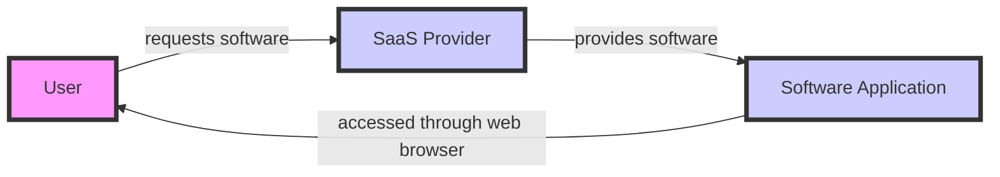

**Example:** Microsoft Office 365 is a SaaS that provides Microsoft Office applications over the internet.

* User requests Microsoft Office 365 software
* SaaS provider provides Microsoft Office 365 software
* User accesses Microsoft Office 365 software through web browser

**IaaS (Infrastructure as a Service)**

IaaS is a cloud computing service model that provides virtualized computing resources over the internet.

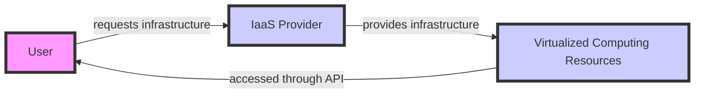

**Example:** Amazon Web Services (AWS) is an IaaS that provides virtualized computing resources over the internet.

* User requests virtualized computing resources
* IaaS provider provides virtualized computing resources
* User accesses virtualized computing resources through API

**PaaS (Platform as a Service)**

PaaS is a cloud computing service model that provides a complete platform for developing, running, and managing applications over the internet.

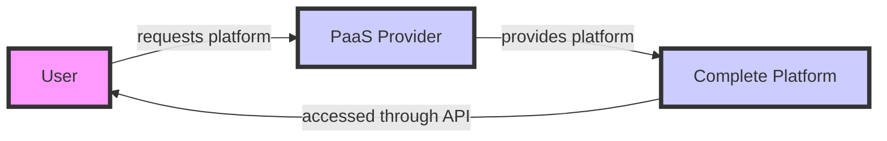

**Example:** Heroku is a PaaS that provides a complete platform for developing, running, and managing applications over the internet.

* User requests complete platform
* PaaS provider provides complete platform
* User accesses complete platform through API

| Service Model | Description |
| --- | --- |
| SaaS | Software as a Service |
| IaaS | Infrastructure as a Service |
| PaaS | Platform as a Service |


## WiFi
WiFi is a wireless networking technology that allows devices to connect to the internet.

```mermaid
graph LR
    A[Device] -->|Authentication Request| B[WiFi Router]
    B -->|Authentication Response| A
    A -->|Association Request| B
    B -->|Association Response| A
    A -->|DHCP Request| B
    B -->|DHCP Response| A
    A -->|Internet Request| B
    B -->|Internet Response| A
    B -->|Internet Connection| C[Internet]
    style A fill:#f9f,stroke:#333,stroke-width:4px
    style B fill:#ccf,stroke:#333,stroke-width:4px
    style C fill:#ccf,stroke:#333,stroke-width:4px
```

**How WiFi Works:**

1. **Authentication:** The device sends an authentication request to the WiFi router, which responds with an authentication response.
2. **Association:** The device sends an association request to the WiFi router, which responds with an association response.
3. **DHCP:** The device sends a DHCP request to the WiFi router, which responds with a DHCP response containing the device's IP address.
4. **Internet Connection:** The device sends an internet request to the WiFi router, which forwards the request to the internet.
5. **Internet Response:** The internet responds to the request, and the WiFi router forwards the response to the device.

**Example:**

Suppose we have a laptop that wants to connect to a WiFi network.

* The laptop sends an authentication request to the WiFi router.
* The WiFi router responds with an authentication response.
* The laptop sends an association request to the WiFi router.
* The WiFi router responds with an association response.
* The laptop sends a DHCP request to the WiFi router.
* The WiFi router responds with a DHCP response containing the laptop's IP address.
* The laptop sends an internet request to the WiFi router.
* The WiFi router forwards the request to the internet.
* The internet responds to the request, and the WiFi router forwards the response to the laptop.

**WiFi Protocols:**

* **802.11:** This is the standard protocol for WiFi networks.
* **WPA2:** This is a security protocol used to encrypt data transmitted over WiFi networks.
* **WPA3:** This is a newer security protocol used to encrypt data transmitted over WiFi networks.

**WiFi Devices:**

* **WiFi Router:** This is the device that provides the WiFi network.
* **WiFi Access Point:** This is a device that connects to a wired network and provides a WiFi network.
* **WiFi Range Extender:** This is a device that extends the range of a WiFi network.

**WiFi Security:**

* **WPA2:** This is a security protocol used to encrypt data transmitted over WiFi networks.
* **WPA3:** This is a newer security protocol used to encrypt data transmitted over WiFi networks.
* **Firewall:** This is a network security system that monitors and controls incoming and outgoing network traffic.

**WiFi Speed:**

* **802.11ac:** This is a WiFi standard that supports speeds up to 1.3 Gbps.
* **802.11ax:** This is a newer WiFi standard that supports speeds up to 9.6 Gbps.
* **WiFi 6:** This is a marketing term used to describe WiFi networks that support the 802.11ax standard.

## Bandwidth
Bandwidth is the amount of data that can be transmitted over a network in a given time.

```mermaid
graph LR
    A[Device 1] -->|Data Transmission| B[Network]
    B -->|Bandwidth Limitation| C[Data Transmission Rate]
    C -->|Data Receipt| D[Device 2]
    style A fill:#f9f,stroke:#333,stroke-width:4px
    style B fill:#ccf,stroke:#333,stroke-width:4px
    style C fill:#ccf,stroke:#333,stroke-width:4px
    style D fill:#f9f,stroke:#333,stroke-width:4px
```

**How Bandwidth Works:**

1. **Data Transmission:** Device 1 sends data to Device 2 through the network.
2. **Bandwidth Limitation:** The network has a bandwidth limitation, which determines the maximum amount of data that can be transmitted in a given time.
3. **Data Transmission Rate:** The data transmission rate is determined by the bandwidth limitation, and it affects the speed at which data is transmitted.
4. **Data Receipt:** Device 2 receives the data transmitted by Device 1.

**Example:**

Suppose we have two devices, a computer and a server, connected to a network with a bandwidth limitation of 100 Mbps.

* The computer sends a file to the server through the network.
* The network has a bandwidth limitation of 100 Mbps, which determines the maximum amount of data that can be transmitted in a given time.
* The data transmission rate is 100 Mbps, which affects the speed at which the file is transmitted.
* The server receives the file transmitted by the computer.

**Bandwidth Types:**

* **Bitrate:** The bitrate is the number of bits transmitted per second, usually measured in bits per second (bps).
* **Baudrate:** The baudrate is the number of symbols transmitted per second, usually measured in baud.
* **Throughput:** The throughput is the actual amount of data transmitted in a given time, usually measured in bits per second (bps).

**Bandwidth Units:**

* **bps (bits per second):** The number of bits transmitted per second.
* **Kbps (kilobits per second):** The number of kilobits transmitted per second.
* **Mbps (megabits per second):** The number of megabits transmitted per second.
* **Gbps (gigabits per second):** The number of gigabits transmitted per second.

**Bandwidth Applications:**

* **Internet:** Bandwidth is used to measure the speed of internet connections.
* **Networking:** Bandwidth is used to measure the speed of data transmission in networks.
* **Telecommunications:** Bandwidth is used to measure the speed of data transmission in telecommunications systems.

**Bandwidth Best Practices:**

* **Monitor bandwidth usage:** Monitor bandwidth usage to ensure that it is within the allocated limits.
* **Optimize bandwidth usage:** Optimize bandwidth usage by compressing data and using efficient transmission protocols.
* **Upgrade bandwidth:** Upgrade bandwidth as needed to ensure that it meets the growing demands of the network.


## QoS
QoS (Quality of Service) is a technology that ensures high-quality network performance for critical applications.

```mermaid
graph TD
    A[Network] -->|Request for QoS| B[QoS Device]
    B -->|Classification| C[Classification of Traffic]
    C -->|Marking| D[Marking of Traffic]
    D -->|Policing| E[Policing of Traffic]
    E -->|Shaping| F[Shaping of Traffic]
    F -->|Queuing| G[Queuing of Traffic]
    G -->|Scheduling| H[Scheduling of Traffic]
    H -->|Forwarding| I[Forwarding of Traffic]
    style A fill:#f9f,stroke:#333,stroke-width:4px
    style B fill:#ccf,stroke:#333,stroke-width:4px
    style C fill:#ccf,stroke:#333,stroke-width:4px
    style D fill:#ccf,stroke:#333,stroke-width:4px
    style E fill:#ccf,stroke:#333,stroke-width:4px
    style F fill:#ccf,stroke:#333,stroke-width:4px
    style G fill:#ccf,stroke:#333,stroke-width:4px
    style H fill:#ccf,stroke:#333,stroke-width:4px
    style I fill:#ccf,stroke:#333,stroke-width:4px
```
**How QoS Works:**

1. **Request for QoS:** The network sends a request for QoS to the QoS device.
2. **Classification:** The QoS device classifies the traffic into different categories based on its priority and type.
3. **Marking:** The QoS device marks the traffic with a specific label or tag to identify its priority and type.
4. **Policing:** The QoS device polices the traffic to ensure that it conforms to the specified rate and burst size.
5. **Shaping:** The QoS device shapes the traffic to ensure that it conforms to the specified rate and burst size.
6. **Queuing:** The QoS device queues the traffic based on its priority and type.
7. **Scheduling:** The QoS device schedules the traffic based on its priority and type.
8. **Forwarding:** The QoS device forwards the traffic to its destination.

**Example:**

Suppose we have a network with two types of traffic: voice and data. We want to ensure that the voice traffic has a higher priority than the data traffic.

* The network sends a request for QoS to the QoS device.
* The QoS device classifies the traffic into voice and data categories.
* The QoS device marks the voice traffic with a high-priority label and the data traffic with a low-priority label.
* The QoS device polices the traffic to ensure that the voice traffic conforms to a specified rate and burst size.
* The QoS device shapes the traffic to ensure that the voice traffic conforms to a specified rate and burst size.
* The QoS device queues the traffic based on its priority and type.
* The QoS device schedules the traffic based on its priority and type.
* The QoS device forwards the traffic to its destination.

## VOIP
VOIP (Voice over Internet Protocol) is a technology that allows voice communication over the internet.

```mermaid
graph TD
    A[Device 1] -->|Voice Signal| B[VOIP Server]
    B -->|Conversion to Digital Signal| C[Digital Signal]
    C -->|Compression| D[Compressed Digital Signal]
    D -->|Packetization| E[Packets]
    E -->|Transmission| F[Internet]
    F -->|Receiving| G[Device 2]
    G -->|Depacketization| H[Depacketized Signal]
    H -->|Decompression| I[Decompressed Digital Signal]
    I -->|Conversion to Analog Signal| J[Analog Signal]
    style A fill:#f9f,stroke:#333,stroke-width:4px
    style B fill:#ccf,stroke:#333,stroke-width:4px
    style C fill:#ccf,stroke:#333,stroke-width:4px
    style D fill:#ccf,stroke:#333,stroke-width:4px
    style E fill:#ccf,stroke:#333,stroke-width:4px
    style F fill:#ccf,stroke:#333,stroke-width:4px
    style G fill:#ccf,stroke:#333,stroke-width:4px
    style H fill:#ccf,stroke:#333,stroke-width:4px
    style I fill:#ccf,stroke:#333,stroke-width:4px
    style J fill:#ccf,stroke:#333,stroke-width:4px
```

**How VOIP Works:**

1. **Voice Signal:** Device 1 sends a voice signal to the VOIP server.
2. **Conversion to Digital Signal:** The VOIP server converts the voice signal to a digital signal.
3. **Compression:** The VOIP server compresses the digital signal to reduce its size.
4. **Packetization:** The VOIP server packetizes the compressed digital signal into packets.
5. **Transmission:** The VOIP server transmits the packets over the internet.
6. **Receiving:** Device 2 receives the packets from the internet.
7. **Depacketization:** Device 2 depacketizes the packets into a depacketized signal.
8. **Decompression:** Device 2 decompresses the depacketized signal into a decompressed digital signal.
9. **Conversion to Analog Signal:** Device 2 converts the decompressed digital signal to an analog signal.

**Example:**

Suppose we have two devices, a computer and a phone, connected to the internet. We want to make a voice call from the computer to the phone using VOIP.

* The computer sends a voice signal to the VOIP server.
* The VOIP server converts the voice signal to a digital signal.
* The VOIP server compresses the digital signal to reduce its size.
* The VOIP server packetizes the compressed digital signal into packets.
* The VOIP server transmits the packets over the internet.
* The phone receives the packets from the internet.
* The phone depacketizes the packets into a depacketized signal.
* The phone decompresses the depacketized signal into a decompressed digital signal.
* The phone converts the decompressed digital signal to an analog signal.

## Cloud Computing
Cloud computing is a model of delivering computing services over the internet.

```mermaid
graph TD
    A[User] -->|Request for Service| B[Cloud Provider]
    B -->|Authentication| C[Authentication]
    C -->|Authorization| D[Authorization]
    D -->|Resource Allocation| E[Resource Allocation]
    E -->|Service Provisioning| F[Service Provisioning]
    F -->|Service Delivery| G[Service Delivery]
    style A fill:#f9f,stroke:#333,stroke-width:4px
    style B fill:#ccf,stroke:#333,stroke-width:4px
    style C fill:#ccf,stroke:#333,stroke-width:4px
    style D fill:#ccf,stroke:#333,stroke-width:4px
    style E fill:#ccf,stroke:#333,stroke-width:4px
    style F fill:#ccf,stroke:#333,stroke-width:4px
    style G fill:#ccf,stroke:#333,stroke-width:4px
```

**How Cloud Computing Works:**

1. **Request for Service:** The user sends a request for a service to the cloud provider.
2. **Authentication:** The cloud provider authenticates the user's identity.
3. **Authorization:** The cloud provider authorizes the user to access the requested service.
4. **Resource Allocation:** The cloud provider allocates the necessary resources to provide the service.
5. **Service Provisioning:** The cloud provider provisions the service.
6. **Service Delivery:** The cloud provider delivers the service to the user.

**Example:**

Suppose we have a user who wants to use a cloud-based word processing service.

* The user sends a request for the service to the cloud provider.
* The cloud provider authenticates the user's identity.
* The cloud provider authorizes the user to access the service.
* The cloud provider allocates the necessary resources to provide the service.
* The cloud provider provisions the service.
* The cloud provider delivers the service to the user.


## Load Balancing
Load balancing is a technique that distributes network traffic across multiple servers to improve performance and availability.

```mermaid
graph TD
    A[Client] -->|Request| B[Load Balancer]
    B -->|Request Distribution| C[Server 1]
    B -->|Request Distribution| D[Server 2]
    B -->|Request Distribution| E[Server 3]
    C -->|Response| B
    D -->|Response| B
    E -->|Response| B
    B -->|Response| A
    style A fill:#f9f,stroke:#333,stroke-width:4px
    style B fill:#ccf,stroke:#333,stroke-width:4px
    style C fill:#f9f,stroke:#333,stroke-width:4px
    style D fill:#f9f,stroke:#333,stroke-width:4px
    style E fill:#f9f,stroke:#333,stroke-width:4px
```

**How Load Balancing Works:**

1. **Request:** The client sends a request to the load balancer.
2. **Request Distribution:** The load balancer distributes the request to one of the available servers.
3. **Response:** The server processes the request and sends a response back to the load balancer.
4. **Response:** The load balancer sends the response back to the client.

**Example:**

Suppose we have a website that receives a large number of requests from clients. We want to use load balancing to distribute the requests across multiple servers to improve performance and availability.

* The client sends a request to the load balancer.
* The load balancer distributes the request to one of the available servers, for example, Server 1.
* Server 1 processes the request and sends a response back to the load balancer.
* The load balancer sends the response back to the client.

**Load Balancing Algorithms:**

* **Round-Robin:** Each incoming request is sent to the next available server in a predetermined sequence.
* **Least Connection:** Incoming requests are sent to the server with the fewest active connections.
* **IP Hash:** Each incoming request is sent to a server based on the client's IP address.

**Load Balancing Benefits:**

* **Improved Performance:** Load balancing can improve the performance of a website or application by distributing requests across multiple servers.
* **Increased Availability:** Load balancing can increase the availability of a website or application by ensuring that requests are always sent to an available server.
* **Scalability:** Load balancing can make it easier to scale a website or application by adding or removing servers as needed.

## Network Security
Network security is the practice of protecting computer networks from unauthorized access, use, disclosure, disruption, modification, or destruction.

```mermaid
graph TD
    A[Network] -->|Security Measures| B[Firewall]
    B -->|Packet Filtering| C[Allowed Traffic]
    B -->|Packet Filtering| D[Blocked Traffic]
    A -->|Security Measures| E[Encryption]
    E -->|Data Encryption| F[Encrypted Data]
    A -->|Security Measures| G[Access Control]
    G -->|Authentication| H[Authenticated Users]
    G -->|Authorization| I[Authorized Users]
    style A fill:#f9f,stroke:#333,stroke-width:4px
    style B fill:#ccf,stroke:#333,stroke-width:4px
    style C fill:#f9f,stroke:#333,stroke-width:4px
    style D fill:#f9f,stroke:#333,stroke-width:4px
    style E fill:#ccf,stroke:#333,stroke-width:4px
    style F fill:#f9f,stroke:#333,stroke-width:4px
    style G fill:#ccf,stroke:#333,stroke-width:4px
    style H fill:#f9f,stroke:#333,stroke-width:4px
    style I fill:#f9f,stroke:#333,stroke-width:4px
```

**How Network Security Works:**

1. **Security Measures:** The network implements security measures such as firewalls, encryption, and access control.
2. **Packet Filtering:** The firewall filters incoming and outgoing packets to block unauthorized access.
3. **Data Encryption:** The encryption algorithm encrypts data to protect it from unauthorized access.
4. **Authentication:** The access control system authenticates users to ensure that only authorized users can access the network.
5. **Authorization:** The access control system authorizes users to access specific resources on the network.

**Example:**

Suppose we have a company that wants to protect its network from unauthorized access. We want to use network security measures such as firewalls, encryption, and access control.

* The company implements a firewall to filter incoming and outgoing packets.
* The firewall blocks unauthorized access to the network.
* The company uses encryption to protect data from unauthorized access.
* The access control system authenticates users to ensure that only authorized users can access the network.
* The access control system authorizes users to access specific resources on the network.

**Network Security Threats:**

* **Malware:** Malicious software that can harm the network.
* **Phishing:** A type of social engineering attack that can trick users into revealing sensitive information.
* **DDoS:** A type of attack that can overwhelm the network with traffic.

**Network Security Best Practices:**

* **Implement Firewalls:** Implement firewalls to filter incoming and outgoing packets.
* **Use Encryption:** Use encryption to protect data from unauthorized access.
* **Implement Access Control:** Implement access control to authenticate and authorize users.
* **Keep Software Up-to-Date:** Keep software up-to-date to prevent vulnerabilities.
* **Monitor Network Activity:** Monitor network activity to detect and respond to security threats.


## Command prompt 
here is an example for a findind and sending the packtes through IP
```bash
(c) Microsoft Corporation. All rights reserved.

C:\Users\vaath\OneDrive\Desktop\MY FILES\C O D E S>ipconfig

Windows IP Configuration


Ethernet adapter Ethernet:

   Connection-specific DNS Suffix  . :
   Link-local IPv6 Address . . . . . : fe80::8a5a:af49:7468:522e%10
   IPv4 Address. . . . . . . . . . . : 192.168.1.2
   Subnet Mask . . . . . . . . . . . : 255.255.255.0
   Default Gateway . . . . . . . . . : fe80::1%10
                                       192.168.1.1

C:\Users\vaath\OneDrive\Desktop\MY FILES\C O D E S>ping 192.168.1.5

Pinging 192.168.1.5 with 32 bytes of data:
Reply from 192.168.1.5: bytes=32 time=59ms TTL=64
Reply from 192.168.1.5: bytes=32 time=36ms TTL=64
Reply from 192.168.1.5: bytes=32 time=45ms TTL=64
Reply from 192.168.1.5: bytes=32 time=59ms TTL=64

Ping statistics for 192.168.1.5:
    Packets: Sent = 4, Received = 4, Lost = 0 (0% loss),
Approximate round trip times in milli-seconds:
    Minimum = 36ms, Maximum = 59ms, Average = 49ms

C:\Users\vaath\OneDrive\Desktop\MY FILES\C O D E S>


```


